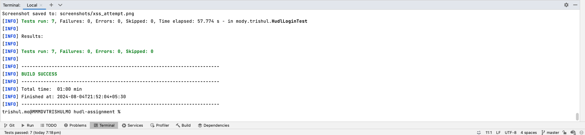
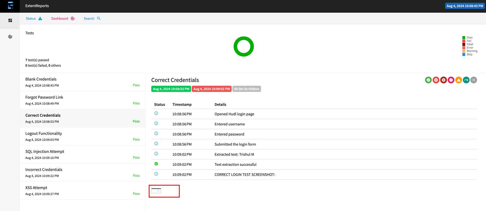

# STEPS TO RUN:

## Replace placeholders with correct creds:
1) Search for "**emailed_username**" and replace with the username sent in email.  
2) Search for "**emailed_password**" and replace with the password sent in email.

## Run tests  
- directly run the test class **`HudlLoginTest.java`**   
or
- **`mvn clean test`**   
      

## Check Report  
- open the file 'extent.html' in a browser.
- check status, info logs and screenshot for each test in the report.
   

## Check Screenshots
- navigate to the screenshots folder in the project.
- check for each screenshot